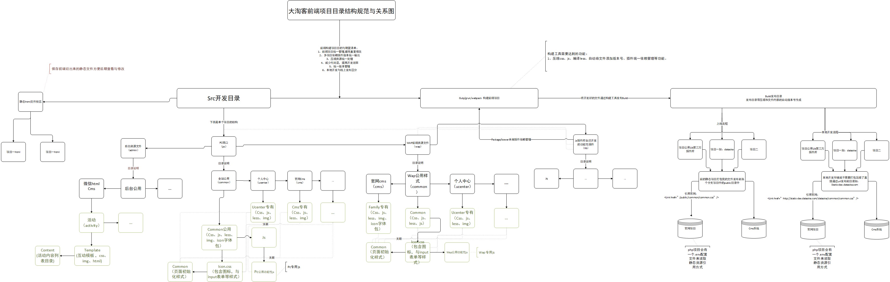

# static项目安装步骤

### 初始化项目
```
git clone 
1.安装淘宝镜像
$ npm install -g cnpm --registry=https://registry.npm.taobao.org
2.开始安装依赖
cnpm install

```


### 本地开发
> 项目名称在 package.json 里面的taskName字段里面
```
gulp 项目名称 
```


### 发布正式版
```
gulp 项目名称+Build  如大淘课：wwwBuild
```

> 如gulp执行失败 在执行一次：
> $ npm install --global gulp


# 大淘客 Web前端开发规范（初稿）

### 规范目的

> 为提高团队协作效率, 便于后台人员添加功能及前端后期优化维护, 输出高质量的文档, 特制订此文档. 本规范文档一经确认,前端开发人员必须按本文档规范进行前台页面开发，本文档如有不对或者不合适的地方请及时提出, 决定后更改此文档。

### 目录
``` 
2.1 文件命名规则
2.2 文件存放位置
2.3 Less 书写规范
2.4 html 书写规范
2.5 JavaScript书写规范
2.6 图片规范
2.7 目录结构规范及前端工程项目依赖规范
2.8 
```

### 一、文件命名规则

> **文件命名原则**

```
文件名称统一用小写的英文字母、数字和下划线的组合，其中不得包含汉字、空格和特殊字符；
命名原则：
一、你自己和工作组的每一个成员能够方便的理解每一个文件的意义。
二、当我们在文件夹中使用“按名称排例”的命令时，同一种大类的文件能够排列在一起，以便我们查找、修改、替换、计算负载量等等操作。
```

> **图片的命名规则**

```
图片的名称分为头尾两部分，用下划线隔开，头部分表示此图片的大类性质
例如：广告、标志、菜单、按钮等等。
放置在页面顶部的广告、装饰图案等长方形的图片取名： banner
标志性的图片取名为： logo
在页面上位置不固定并且带有链接的小图片我们取名为 button
在页面上某一个位置连续出现，性质相同的链接栏目的图片我们取名： menu
装饰用的照片我们取名： pic
不带链接表示标题的图片我们取名： title
范例：banner_sohu.gif banner_sina.gif menu_aboutus.gif menu_job.gif title_news.gif logo_police.gif logo_national.gif pic_people.jpg
鼠标感应效果图片命名规范为"图片名+_+on/off"。
例如：menu1_on.gif menu1_off.gif
公用图标要用psd拼接成一张png进行输出，并且在psd文件里面做好辅助线。
拼接的图标图片已icon.png保持。
```
### 二、Less 书写规范

> **LESS/CSS/js文件命名规则**

```
LESS命名与当前项目模块的英文名称命名例如：
模块名称	文件目录	文件名
登录        login       login.less
购物车      defray      defray.less
个人中心    ucenter     ucenter.less
帮助中心    help        help.less
```

> **.LESS/.CSS等样式文件编写规则**

```
样式文件编写规范，class命名规则以模块英文名称 “首字母大写或者简写” 开头如官网首页 “home_banner” 详细如下：

注意：样式结构规则以（依赖，公用，独立模块）的顺序书写样式。

**LESS文件范例**
//编辑者:NAME
//用途:XXX项目  
charset "UTF-8";
@import "../less_public/scaffolding.less";//初始化样式 
@import "../common/icon.less";//全站通用图标  

@hoem_icon:url(../homeimages/icon.png) no-repeat;
.home_icon{ 
    background: @hoem_icon; display: inline-block; .p_r; 
}
.home_icon1{ .w_h(33px,33px); }
.home_icon2,.home_icon2_no{ .bg_p(-33px,0px); .w_h(33px,33px); }
.home_icon2_no{ .bg_p(0px,-33px); }

样式正文
....

```
###三、JavaScript书写规范
> **JavaScript书写规范**

```
1. 书写过程中, 每行代码结束必须有分号; 原则上所有功能均根据XXX项目需求原生开发, 以避免网上down下来的代码造成的代码污染(沉冗代码 || 与现有代码冲突 || ...);
2. 库引入: 原则上仅引入jQuery库, 若需引入第三方库, 须与团队其他人员讨论决定;
3. 变量命名: 驼峰式命名. 原生JavaScript变量要求是纯英文字母, 首字母须小写, 如iTaoLun; jQuery变量要求首字符为'_', 其他与原生JavaScript 规则相同, 如: _iTaoLun; 另, 要求变量集中声明, 避免全局变量.
4. 类命名: 首字母大写, 驼峰式命名. 如 ITaoLun;
5. 函数命名: 首字母小写驼峰式命名. 如iTaoLun();
6. 命名语义化, 尽可能利用英文单词或其缩写;
7. 尽量避免使用存在兼容性及消耗资源的方法或属性, 比如eval() & innerText;
8. 后期优化中, JavaScript非注释类中文字符须转换成unicode编码使用, 以避免编码错误时乱码显示;
9. 代码结构明了, 加适量注释. 提高函数重用率;
10. 注重与html分离, 减小reflow, 注重性能.
11. 尽量不要在全局中随意使用function或var这样会污染全局命名空间。
12. 编写都用JS严格模式

** 封装模板一 **

/** 
 * 通用确认框架 
 *  
 * @author TRS bwl(***@163.com) 
 * @since 2016-05-20 04:46 
 */  
!(function($window){
    "use strict";
    // ---------------------------------------------------------  
    if (typeof $ == "undefined") {  
        var $ = function(sid) {  
            if (typeof sid == "string") {  
                return document.getElementById(sid);  
            }  
            return sid;  
        };  
    }  
    //-----------  封装stringBuffer对象，可以节省字符串拼接的开销  -----------  
    function xStringBuffer() {  
        this._strings_ = new Array();  
    }  
    xStringBuffer.prototype.append = function (str) {  
        this._strings_.push(str);  
    };  
    xStringBuffer.prototype.toString = function () {  
        var str = this._strings_.join("");  
        delete this._strings_;  
        this._strings_ = new Array();  
        return str;  
    };  
    $window.$xStringBuffer = xStringBuffer;
})(window);

/* 更多实现。。。 */  
....

```
> **公用形插件管理**

JS插件不可随意引用，如需要引用要有先调研其稳定性，并必须开源到GIThub或者OSchinas上的js插件，不开源的最好不要使用。

```
插件的依赖管理我建议使用:[bower][1],或者[package>package.json][2] 来管理，打包后的插件发布到前端资源的lib目录即可。
目录     插件名称/插件       插件
lib         jquery.js	        ---
lib         layer（文件名称）   layer.js layer.min.js
lib         qrcode	            qrcode.js qrcode.min.js	

```
###四、图片规范

> **切图原则**

```
尽量保持原始效果的情况下，把图片压缩到最小（通常我们的jpg和gif压缩到70%左右最合理）；切图无非就两种模式，第一种拼接方式用background-position来调整图片显示区域，这种方式实用与icon图标，第二种就是常见的单个元素背景，这种实用与大块背景等。我们在平常切图的时候尽量使用拼接的方式来切图可以减少页面http请求,利于后期维护。
   
 推荐几个专门在线压缩PNG的网站：
 
[www.tinypng.com][3] 
[www.punypng.com][4]
[www.tuhaokuai.com/image?b-png][5]
```
**common/icon.psd 介绍**

```
common里面存放的是公用模块，可复用与全站。里面的icon.png/icon.psd 是整站的公用图标存放，psd存放着iocn原文件，包含切片信息。
```
**.psd原文件标线查考**

```
注意：这里只能存放公用图标。
```
**专属目录 介绍（help、login、ucenter）**
```
专属目录里面的icon.png 存放这个功能模块专有图标，里面图片命名通常更具图片涵义英文名命名规则。
```

**前项目结构思路**
```
首先我们的目录要支撑多个项目，并要支持多项目构建发布。
每个项目都会公用一套lib插件依赖管理机制。
每个项目都会有一个gulp/grunt/webapck发布目录。
每个项目都会有一个wap端和一个pc端等。
每个项目都会有css和less原文件目录。
每个项目都会有一个html目录。
下面我们就来解决这些问题：
```
[](https://w3cui.github.io/modularEidt/build/vsdx.png)


  [1]: https://bower.io/
  [2]: https://docs.npmjs.com/cli/npm
  [3]: www.tinypng.com
  [4]: www.punypng.com
  [5]: www.punypng.com